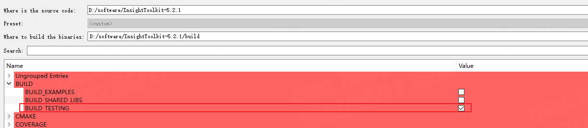
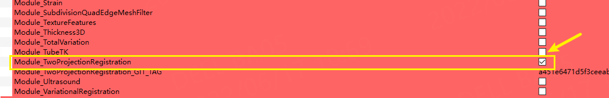
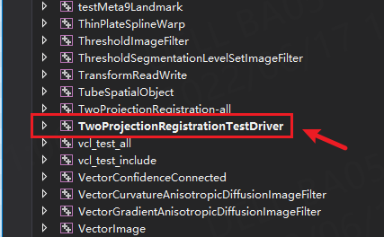
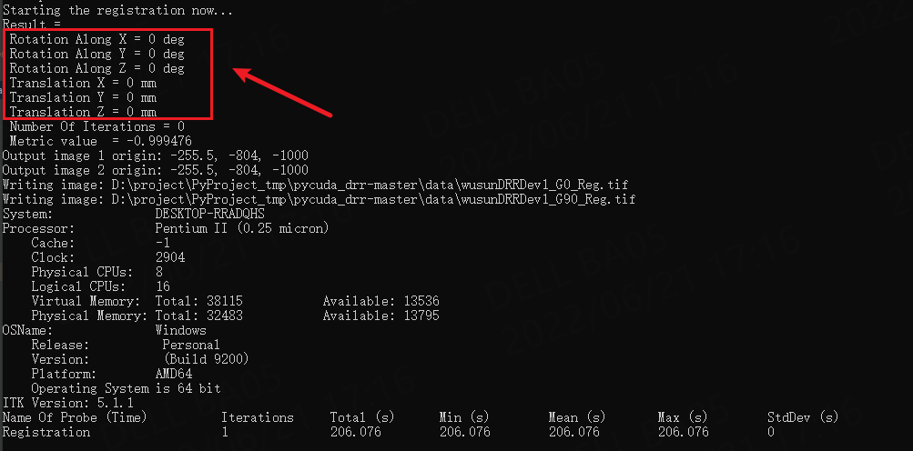

# windows下ITK中的2D/3D配准介绍
##
1.下载ITK进行源码编译，在编译的时候，勾选上以下两个选项

BUILD_TESTING: 该选项会编译生成相应的exe文件进行，用于测试

Module_TwoProjectionRegistration:该选项会从github上下载该仓库，然后进行编译

编译勾选项1

编译勾选项2

##
2.在cmake下编译完后，然后打开sln，找到TwoProjectionRegistrationTestDriver这个工程

生成的工程文件

##
3.命令行调用
编译该工程文件后，会生成一个TwoProjectionRegistrationTestDriver.exe的文件，使用命令如下

(1)生成DRR

TwoProjectionRegistrationTestDriver.exe  
###
                                         GetDRRSiddonJacobsRayTracing              #调用的具体方法
                                         -v -rp -0 -rx 0 -ry 0 -rz 0 -t 0 0 0      #-v verbose显示 -rp Projection angle in degrees
                                         -iso 256.0 356.0 805 -res 1.0 1.0         #
                                         -size 512 1609                            #DRR图像的像素大小
                                         -o D:\project\PyProject_tmp\pycuda_drr-master\data\wusun_drr.tif  #生成的DRR文件保存名称
                                         D:\project\PyProject_tmp\pycuda_drr-master\data\wusun.nii.gz      #输入文件

(2)2d3d配准

TwoProjectionRegistrationTestDriver.exe  
####
                                         TwoProjection2D3DRegistration             #调用的具体方法
                                         -res 1 1 1 1 -iso 256.0 356.0 805         #
                                         -o D:\project\PyProject_tmp\pycuda_drr-master\data\wusunDRRDev1_G0_Reg.tif     #输出的两个配准后的图像
                                            D:\project\PyProject_tmp\pycuda_drr-master\data\wusunDRRDev1_G90_Reg.tif 
                                         D:\project\PyProject_tmp\pycuda_drr-master\data\wusun_drr.tif 0                #输入的两个Fixed_image及其投影的角度
                                         D:\project\PyProject_tmp\pycuda_drr-master\data\wusun_drr_90.tif 90
                                         D:\project\PyProject_tmp\pycuda_drr-master\data\wusun.nii.gz                   #输入文件
                                         
                                         
                                         
TwoProjectionRegistrationTestDriver.exe GetDRRSiddonJacobsRayTracing -v -rp 90 -rx 3 -ry 4 -rz 2 -t 5 5 5 -iso 255.0 259.0 130 -res 0.5 0.5 -size 512 512 -o D:\software\ITK-5.1.1\build\bin\data\BoxheadDRRFullDev1_G90.tif  D:\software\ITK-5.1.1\build\bin\data\BoxheadCTFull.img

(3)配准输入输出说明：
    输入：输入的是两幅fixed image.这两幅fixed_image,是在相同的内外参数下，分别在正位和侧位拍摄的x图像。
         配准的目的就是求出，CT数据在哪个外参数下，得到的DRR和这两个fixed_image的相似度最大
    输出：6个参数，rotx,roty,rotz,tx,ty,tz
    
    结果如下：
   