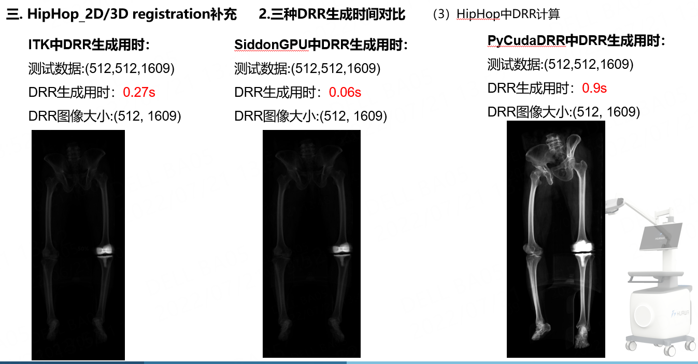

# DRR生成算法，SiddonGPU
基于CUDA C实现的

源代码参考 https://github.com/fabio86d/CUDA_DigitallyReconstructedRadiographs

# 源代码存在的问题：
1.生成的DRR只能是DRRsize_x == DRRsize_y，否则会报错

改进：

完善了生成DRR接口，将DRRsize_x和DRRsize_y参数传递给kernel函数，进行DRR计算

2.没有C+++调用的demo

补充C++调用Demo

3.bug修改。在生成DRR时，cuda内存越界访问

	update_idx(i_v, j_v, k_v, MovSize[0], MovSize[1], arrayIdx);

	if (arrayIdx_old > 0.) {
		// update density value
		if (arrayIdx_old < MovSize[0] * MovSize[1] * MovSize[2]) //add check
		{
			if (movImgArray[arrayIdx_old] != 0.)
			{
				density_value += movImgArray[arrayIdx_old] * l;
				//std::cout << density_value << std::endl;
			}
		}
	}
	// update arrayIdx
	arrayIdx_old = arrayIdx;

4.增加旋转平移矩阵的计算

5.增加多次循环调用，在不同旋转角度下的

# 编译
1.操作系统 win10, GPU, cmake, VS2015/2017/2019, 显卡RTX1050 2GB

2.默认已经安装好Cuda，并且已经在本地编译安装好ITK

3.直接在Cmake-gui中，进行编译

# 补充说明,坐标系统：

## 1.在C++demo中，DRR生成的坐标系是DICOM中的世界坐标。

  3D CT数据的中心点(volume_center_x, volume_center_y, volume_center_z)

## 2.放射源source pointd点位置：

  VCS:Volume_center to source
  
  source_point = (volume_center_x, volume_center_y - VCS, volume_center_z)

## 3.接收平面 detector plane设置在：

  VCD:Volume_center to detector

  DRRsize_x, DRRsize_y, DRRspacing_x, DRRspacing_y
  
  detector_plane position:

  (volume_center_x - DRRsize_x/2.0*DRRspacing_x, volume_center_y + VCD, volume_center_z - DRRsize_y/2.0*DRRspacing_y)
  
  (volume_center_x + DRRsize_x/2.0*DRRspacing_x, volume_center_y + VCD, volume_center_z + DRRsize_y/2.0*DRRspacing_y)

# DRR生成时间对比
测试数据大小(512, 512, 1609)，生成DRR大小(512, 1609)

1.ITK  https://github.com/InsightSoftwareConsortium/ITKTwoProjectionRegistration  0.27s

2.pycuda  https://github.com/yuta-hi/pycuda_drr  0.9s

3.SiddonGPU  0.06s

# 使用

1.使用C++生成DRR图像后，保存为drr.txt

2.使用python进行显示图像，load_show_drr.py

# 补充：
测试数据 nii.gz 下载

https://github.com/rg2/xreg/wiki/Walkthrough%3A-Data  pelvis.nii.gz
